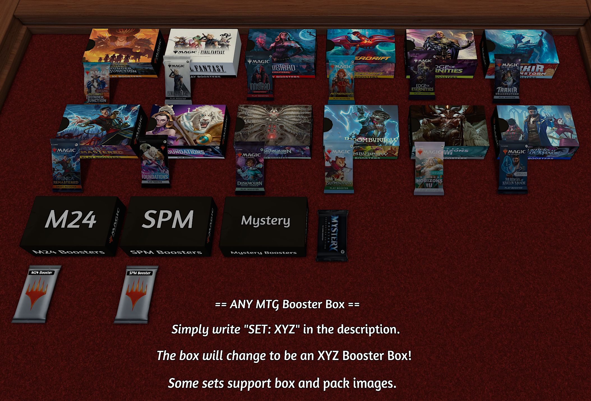

# Any MTG Booster Generator

Ever wanted to crack open fresh Magic: The Gathering booster packs right inside Tabletop Simulator?  
This mod brings that excitement to your virtual table!

With a single container and a set code, you can instantly generate boosters from nearly any MTG set, powered by [Scryfall](https://scryfall.com/)'s database.  
Perfect for limited formats like Draft, Sealed, or Cube!

---

## 🎮 Features

- Automatically generates booster packs for **any set** using real Scryfall data.
- Supports special pack rules (e.g., Ravnica guild packs, Innistrad transform slots, Strixhaven archives, Zendikar Rising pathways, etc.).
- Correct rarity distribution, including *mythics, rares, uncommons, commons,* and lands.
- Handles special cases like Masterpieces, Expeditions, Timeshifted, and Showcase frames.
- Double-faced cards (DFC) and split cards are generated correctly with front/back images.
- Generates clean booster stacks with card names, oracle text, and high-quality images.
- Works seamlessly in Draft, Sealed, or casual pack-opening fun.
- Easy to use: just update the object’s description with `SET: XYZ` (e.g., `SET: M24`) and start generating!

---

## 📦 Supported Models

- **Supported packs:** MYSTERY, FIN, INR, DFT, EOE, TDM, FDN, DSK, BLB, MH3, MKM, OTJ, RVR, XML, KHM, MID, STX, AFR, UST, UGL, UNH, VOW, UMA, CMM, MMA, 2XM, SOK, NEO, BOK, CHK, SPM
- **Supported boxes:** FIN, INR, DFT, EOE, TDM, FDN, DSK, BLB, MH3, MKM, OTJ, RVR, UMA, CMM, MMA, 2XM, SOK, NEO, BOK

---

## 📝 How to Use

1. Place the booster container on the table.
2. In the object description, add a line like: `SET: MID` (for *Innistrad: Midnight Hunt*).
3. Pull objects out of the container to generate boosters.
4. Open them, draft them, or just enjoy the pack-cracking experience!

---

## 🙌 Credits & Thanks

This mod uses the [Scryfall API](https://scryfall.com/) for real-time card data and images.

**Built with passion, assets and inspiration came from the following mods:**

- [Mystery Booster: Convention Edition 2021 Pack Creator by Malixx](https://steamcommunity.com/sharedfiles/filedetails/?id=2661350504)
- [MTG 2024 All Sets and Commander Precons by Lord_Chrisicus](https://steamcommunity.com/sharedfiles/filedetails/?id=3401546551)
- [MTG 2025 All Sets and Commander Precons by Lord_Chrisicus](https://steamcommunity.com/sharedfiles/filedetails/?id=3412420737)
- [Mtg Ixalan Booster Pack Model by Tigrezno](https://steamcommunity.com/sharedfiles/filedetails/?id=1152105520)
- [Kaldheim MTG Boosters by .BAD. Épísôdè -(OG)](https://steamcommunity.com/sharedfiles/filedetails/?id=2630198785)
- [Innistrad Midnight Hunt MTG Boosters by .BAD. Épísôdè -(OG)](https://steamcommunity.com/sharedfiles/filedetails/?id=2631757831)
- [MTG StrixHaven Boosters by .BAD. Épísôdè -(OG)](https://steamcommunity.com/sharedfiles/filedetails/?id=2627675676)
- [MTG Adventures in Forgotten Realms Boosters by .BAD. Épísôdè -(OG)](https://steamcommunity.com/sharedfiles/filedetails/?id=2629204356)
- [MTG Booster Boxes, Commander Masters, Ultimate Masters & Modern Masters by .BAD. Épísôdè -(OG)](https://steamcommunity.com/sharedfiles/filedetails/?id=3044355322)
- [MTG Double Masters 72 cnt. Booster Box by .BAD. Épísôdè -(OG)](https://steamcommunity.com/sharedfiles/filedetails/?id=3034796320)
- [MTG Kamigawa Block Booster Boxes by .BAD. Épísôdè -(OG)](https://steamcommunity.com/sharedfiles/filedetails/?id=3044444843)
- [Unstable Booster Pack Creator by Malixx](https://steamcommunity.com/sharedfiles/filedetails/?id=2670765095)
- [Unglued Booster Pack Creator by Malixx](https://steamcommunity.com/sharedfiles/filedetails/?id=2670769757)
- [Unhinged Booster Pack Creator by Malixx](https://steamcommunity.com/sharedfiles/filedetails/?id=2670767248)

Huge thanks to the creators of existing MTG mods in the TTS community who inspired this work!

---

## 📚 Resources

- [Assets and a copy of the savegame on GitHub](https://github.com/cornernote/tabletop_simulator-mtg_booster_generator)
- [Game on Tabletop Simulator Steam Workshop](https://steamcommunity.com/sharedfiles/filedetails/?id=3558729769)

---
